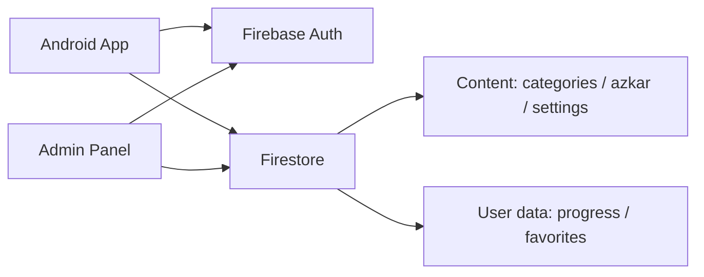

# خطة رفع أذكار إلى منتج متكامل

## الهدف
تحويل التطبيق من نموذج Android محلي ولوحة HTML تجريبية إلى منتج عربي متماسك: تجربة قراءة مريحة، محتوى مركزي تديره لوحة خاصة، ومزامنة آمنة عبر Firebase.

## المعمارية المستهدفة

التطبيق يقرأ المحتوى المنشور من Firestore مع إبقاء نسخة محلية للعمل دون اتصال. لوحة الإدارة لا تكتب مباشرةً من دون تسجيل دخول؛ صلاحية المشرف تكون عبر Firebase custom claim باسم `admin: true`. تقدّم المستخدم يبقى معزولاً داخل `users/{uid}`، بينما المحتوى العام يُنشر فقط عبر وثائق `content/*`.

## مراحل التنفيذ

| المرحلة | النتيجة | شرط الخروج |
|---|---|---|
| الأساس والأمان | قواعد Firestore، لا أسرار في المستودع، عقد محتوى ثابت | لا يمكن للمستخدم العادي الكتابة إلى المحتوى |
| تجربة Android | واجهة منزلية، قارئ أذكار، مفضلة، نسخ ومشاركة، offline-first | مسارات القراءة الأساسية تعمل دون شبكة |
| لوحة الإدارة | دخول مشرف، محرر نص منظم، حالات مسودة/منشور، سجل تحديث | لا تظهر أدوات الإدارة قبل التحقق من claim |
| المزامنة | نشر من اللوحة إلى التطبيق، تعارضات واضحة، نسخة cache | تعديل ذكر من اللوحة يظهر بعد refresh آمن |
| الجودة والنشر | اختبارات، مراقبة أخطاء، بيانات أولية، إعدادات نشر | APK وواجهة الإدارة قابلان للنشر والتراجع |

## نموذج البيانات

- `content/categories/{categoryId}`: الاسم، الوصف، الأيقونة، الترتيب، `isPublished`.
- `content/azkar/{zekrId}`: النص، الفضل، المصدر، عدد التكرار، `categoryId`، الترتيب، `isPublished`, `updatedAt`.
- `content/appSettings`: النسخة، رسالة اليوم، تفعيل الميزات.
- `users/{uid}/progress/{date}`: تقدّم اليوم فقط.
- `users/{uid}/favorites/{zekrId}`: مفضلة المستخدم.

## ما يحتاجه الربط الفعلي

1. ملف `google-services.json` لتطبيق Android.
2. إعداد Web App في نفس مشروع Firebase للوحة.
3. تفعيل Google Auth وFirestore.
4. إنشاء حساب المشرف ومنحه custom claim `admin` من بيئة موثوقة، وليس من JavaScript المتصفح.

## ملاحظات أمنية

`noindex` و`robots.txt` يمنعان الفهرسة فقط ولا يمنعان الدخول. حماية اللوحة الحقيقية هي Firebase Auth + Firestore Rules + استضافة HTTPS. لا تضع مفاتيح Gemini أو مفاتيح Firebase الخاصة داخل ملفات الواجهة العامة.
